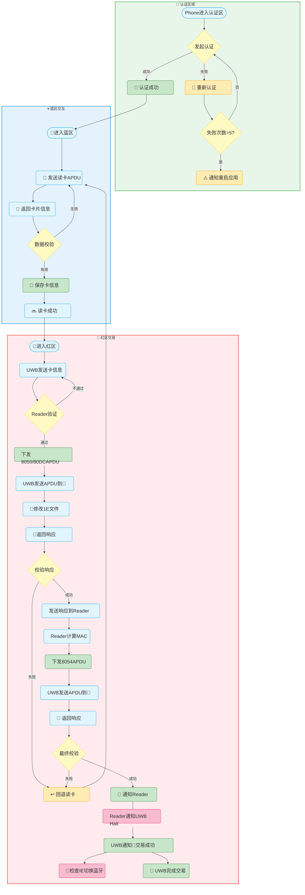

```mermaid
flowchart TB
    %% 定义全局样式
    classDef default fill:#fff,stroke:#666,width:200px,height:60px,rx:5,ry:5,text-align:left,font-size:30px
    classDef process fill:#E1F5FE,stroke:#039BE5,font-size:21px,text-align:center
    classDef decision fill:#FFF9C4,stroke:#FDD835,shape:diamond,font-size:21px
    classDef success fill:#C8E6C9,stroke:#2E7D32,font-size:21px
    classDef warning fill:#FFECB3,stroke:#FFA000,font-size:21px
    classDef terminal fill:#F8BBD0,stroke:#E91E63,font-size:21px

    subgraph AUTH["🚦 认证区域"]
        direction TB
        A1(["Phone进入认证区"]):::process
        A2{"发起认证"}:::decision
        A3["🎯 认证成功"]:::success
        A4["🔄 重新认证"]:::warning
        A5{"失败次数>5?"}:::decision
        A6["⚠️ 通知重启应用"]:::warning
    end

    subgraph BLUE["🌀 蓝区交互"]
        direction TB
        B1(["📱进入蓝区"]):::process
        B2["📡 发送读卡APDU"]:::process
        B3["📲 返回卡片信息"]:::process
        B4{"数据校验"}:::decision
        B5["💾 保存卡信息"]:::success
        B6["🔜 读卡成功"]:::process
    end

    subgraph RED["🚩 红区交易"]
        direction TB
        C1(["📱进入红区"]):::process
        C3["UWB发送卡信息"]:::process
        C4{"Reader验证"}:::decision
        C5["下发8050/80DCAPDU"]:::success
        C19["UWB发送APDU到📱"]:::process
        C6["📱修改1E文件"]:::process
        C20["📱返回响应"]:::process
        C7{"校验响应"}:::decision
        C8["↩️ 回退读卡"]:::warning
        C9["发送响应到Reader"]:::process
        C10["Reader计算MAC"]:::process
        C11["下发8054APDU"]:::success
        C21["UWB发送APDU到📱"]:::process
        C12["📲 返回响应"]:::process
        C13{"最终校验"}:::decision
        C14["📩 通知Reader"]:::success
        C15["Reader通知UWB Halt"]:::terminal
        C16["UWB通知📱交易成功"]:::success
        C17["📱检查IE切换蓝牙"]:::terminal
        C18["📡 UWB完成交易"]:::success
    end

    %% 连接关系
    A1 --> A2
    A2 -- 成功 --> A3 --> B1
    A2 -- 失败 --> A4 --> A5
    A5 -- 是 --> A6
    A5 -- 否 --> A2
    B1 --> B2 --> B3 --> B4
    B4 -- 有效 --> B5 --> B6 --> C1
    B4 -- 无效 --> B2
    C1 --> C3 --> C4
    C4 -- 通过 --> C5 --> C19 --> C6 --> C20 --> C7
    C4 -- 不通过 --> C3
    C7 -- 失败 --> C8 --> B2
    C7 -- 成功 --> C9 --> C10 --> C11 --> C21--> C12 --> C13
    C13 -- 成功 --> C14 --> C15 --> C16 --> C17 & C18
    C13 -- 失败 --> C8

    %% 子图样式
    style AUTH fill:#E8F5E9,stroke:#4CAF50,stroke-width:2px,width:800px
    style BLUE fill:#E3F2FD,stroke:#2196F3,stroke-width:2px,width:470px
    style RED fill:#FFEBEE,stroke:#F44336,stroke-width:2px,width:1000px
    style C19 width:250px
    style C5 width:250
    style C9 width:250
    style C21 width:250
    style C15 width:250
    style C16 width:300

```